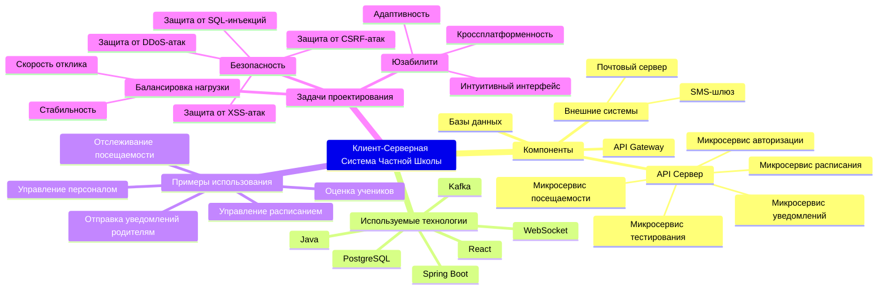
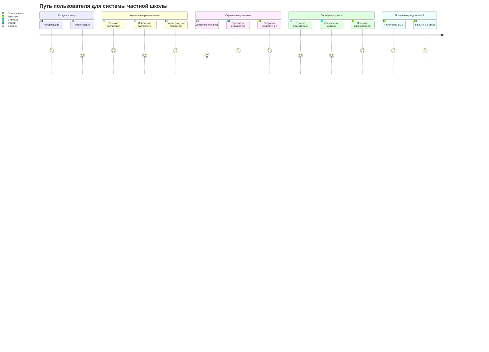
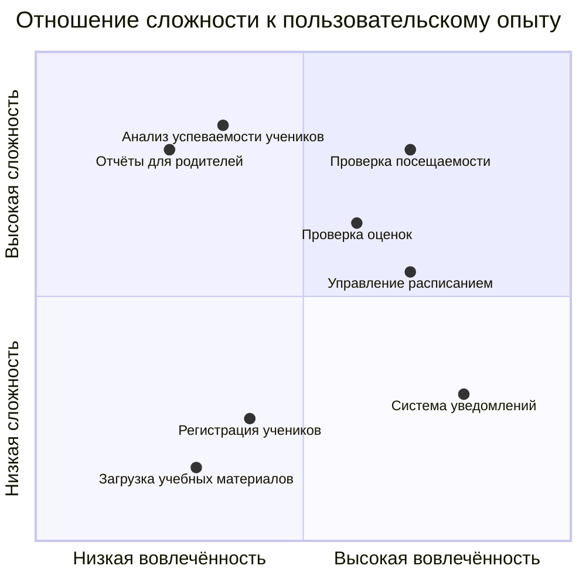
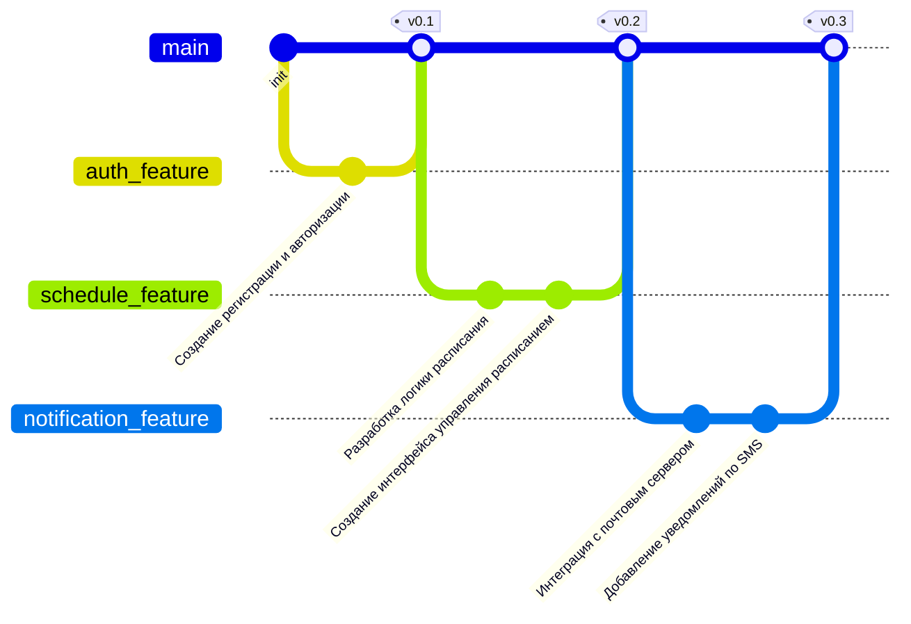

# pkss

```mermaid
mindmap
  Клиент-Серверная Система Частной Школы
    Компоненты
      API Сервер
        Микросервис авторизации
        Микросервис расписания
        Микросервис уведомлений
        Микросервис тестирования
        Микросервис посещаемости
      Внешние системы
        Почтовый сервер
        SMS-шлюз
      Базы данных
      API Gateway
    Используемые технологии
      Java
      PostgreSQL
      Spring Boot
      React
      WebSocket
      Kafka
    Примеры использования
      Управление расписанием
      Отслеживание посещаемости
      Оценка учеников
      Отправка уведомлений родителям
      Управление персоналом
    Задачи проектирования
      Балансировка нагрузки
        Стабильность
        Скорость отклика
      Юзабилити
        Интуитивный интерфейс
        Адаптивность
        Кроссплатформенность
      Безопасность
        Защита от SQL-инъекций
        Защита от CSRF-атак
        Защита от XSS-атак
        Защита от DDoS-атак
```

```mermaid
journey
    title Путь пользователя для системы частной школы
    section Вход в систему
      Авторизация: 5: Пользователь
      Регистрация: 4: Пользователь
    section Управление расписанием
      Просмотр расписания: 5: Учитель
      Изменение расписания: 4: Учитель
      Подтверждение изменений: 5: Учитель
    section Оценивание учеников
      Добавление оценок: 4: Учитель
      Просмотр результатов: 5: Ученик
      Отправка уведомлений: 5: Родитель
    section Посещение уроков
      Отметка присутствия: 4: Учитель
      Обновление данных: 4: Система
      Просмотр посещаемости: 5: Родитель
    section Получение уведомлений
      Получение SMS: 5: Родитель
      Получение Email: 5: Родитель
```

```mermaid
    quadrantChart
        title Отношение сложности к пользовательскому опыту
        x-axis "Низкая вовлечённость" --> "Высокая вовлечённость"
        y-axis "Низкая сложность" --> "Высокая сложность"
        "Управление расписанием": [0.7, 0.55]
        "Регистрация учеников": [0.4, 0.25]
        "Анализ успеваемости учеников": [0.35, 0.85]
        "Система уведомлений": [0.8, 0.3]
        "Проверка оценок": [0.6, 0.65]
        "Загрузка учебных материалов": [0.3, 0.15]
        "Проверка посещаемости": [0.7, 0.8]
        "Отчёты для родителей": [0.25, 0.8]
```

```mermaid
gitGraph
commit id: "init"
    branch auth_feature
    checkout auth_feature
    commit id: "Создание регистрации и авторизации"
    checkout main
    merge auth_feature tag: "v0.1"

    branch schedule_feature
    checkout schedule_feature
    commit id: "Разработка логики расписания"
    commit id: "Создание интерфейса управления расписанием"
    checkout main
    merge schedule_feature tag: "v0.2"

    branch notification_feature
    checkout notification_feature
    commit id: "Интеграция с почтовым сервером"
    commit id: "Добавление уведомлений по SMS"
    checkout main
    merge notification_feature tag: "v0.3"

```
